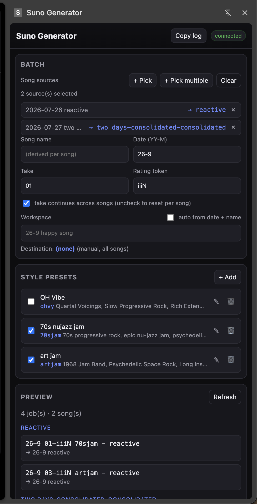

# Suno Generator

**Suno Generator** is a Chrome (Manifest V3) extension that batch-generates
[Suno](https://suno.com) **Cover Song** variations from saved **style presets**,
applying your naming and workspace conventions. It works by driving the real
suno.com UI — there is no public Suno API and Workspaces are UI-only.

Give it one or more source songs and a set of presets; it walks Suno's own
cover flow for each preset (set the cover source, Advanced mode, style, title,
lyrics, workspace) and submits the batch, then monitors each job to completion.



---

## ⚠️ Disclaimer

This is an **unofficial, personal-use tool**. It is **not affiliated with,
endorsed by, or supported by Suno**. It automates the suno.com web UI, which
may violate Suno's Terms of Service and can break whenever Suno ships UI
changes. Use it at your own risk.

- Generating songs (and downloading them) **spends credits / plan allowances**.
- The developer harness can be told to actually submit jobs — only do so on an
  account and with credits you are willing to spend.
- Provided under the MIT License, with no warranty (see [`LICENSE`](LICENSE)).

## Status

A developer tool at the moment: it is **loaded unpacked**, not published to the
Chrome Web Store, and has no automated test suite. Selectors and behaviours are
verified against live Suno but can drift.

## Features

- **Multiple sources** — pick one or several source songs; names are derived
  per source and de-duplicated.
- **Style presets** — each with a style prompt, a short style code, optional
  lyrics, and an optional workspace override.
- **Naming conventions** — automatic titles and workspace names (see below),
  with a "take" counter that steps by 2 per job (Suno always makes 2 clips per
  Create).
- **Batch engine** — expands *sources × presets* into jobs, fills the create
  form, selects/creates the workspace, verifies it, and submits.
- **Status monitoring** — watches each job through `queued → streaming →
  complete`, deduped across the DOM poll and a network hook.
- **Download badges** — per-row indicators for unlock state, uploads, Chrome
  download history, and files actually on disk (see below).
- **Folder scan** — optionally point it at your downloads folder to mark which
  clips are on disk, matched by the clip id embedded in the audio file.

## Requirements

- Desktop **Google Chrome 114+** (side panel support).
- For the optional dev harness: **Node 24+** and `npm`.

## Installation (load unpacked)

1. Get the code:
   ```bash
   git clone <your-repo-url> suno-gen
   # or download and unzip the repository
   ```
2. Open `chrome://extensions` in Chrome.
3. Enable **Developer mode** (top right).
4. Click **Load unpacked** and select the **`suno-gen/`** folder (the one
   containing `manifest.json`).
5. Pin the extension, then click its toolbar icon to open the **side panel**
   (the panel opens on click by design).

### Reloading after code changes

Content scripts self-heal: opening the side panel re-injects the latest code
into the active Suno tab. If behaviour still looks stale:

- Click **Tools → Reload extension** in the panel (or the ↻ button on the card
  at `chrome://extensions`), and
- reload the Suno tab once.

## Usage

1. Open a Suno page that shows your clip list (e.g. the Library).
2. In the panel, click **Pick** (one source) or **Pick multiple** (stays armed
   until <kbd>Esc</kbd>) and click song rows.
3. Fill the **Batch** fields: date, take, rating token, and (optionally) a song
   name and workspace.
4. Tick the **style presets** you want.
5. Tick **dry run** first to preview jobs without submitting.
6. Click **Generate batch**.

### Naming & workspaces

- **Title template:** `{date} {take}-{rating} {styleCode} - {songName}`
  - `date` = `YY-M` (e.g. `26-9`); `take` = 2-digit and steps by 2 per style;
    `rating` defaults to the literal `iiiN` (a searchable placeholder you edit
    later); `styleCode` = no spaces, ≤ 8 chars.
  - Example: `26-9 01-iiiN qhvy - happy song`
- **Workspace:** defaults to `{date} {songName}` (e.g. `26-9 bird song`), or a
  per-preset override. Missing workspaces are auto-created.

## Download badges

Small badges on each clip row show independent facts:

| Icon | Meaning |
|------|---------|
| Grey open padlock | **Unlocked** on Suno — re-download is free |
| Purple sprout | An unlocked clip that is **your own upload** |
| Violet down-arrow | A download was seen in **Chrome download history** |
| Green tick (top-right) | A file is **on disk** (found by the folder scan) |

Each badge has its own checkbox under **Tools**. The on-disk badge's tooltip
shows the matched file path.

### Folder scan

Click **Tools → Connect download folder** and grant read access to your Suno
downloads folder (via the File System Access API). The scan:

- Matches files to clips by the clip id embedded in the audio metadata (M4A
  `©cmt`, WAV `ICMT`, and the C2PA `com.suno.provenance` / `icontentIdx` block).
- Is **authoritative** for "on disk": a rescan drops on-disk facts whose file is
  gone (history facts are left alone).
- Is **incremental**: it caches `{size, mtime, id}` per file in IndexedDB, so
  unchanged files are skipped on rescans. "Rebuild index" forces a clean
  re-resolve.

Permissions for the folder are re-prompted by the browser after a restart; use
**Reconnect download folder** to re-grant. Audio *streams* are encrypted and not
readable; only files you have saved are inspected.

## Permissions

| Permission | Why |
|------------|-----|
| `sidePanel` | The UI lives in Chrome's side panel. |
| `storage` | Presets, settings, and status live in `chrome.storage.local`. |
| `scripting` | Inject/refresh content scripts into an already-open Suno tab. |
| `tabs` | Find and message the active Suno tab. |
| `downloads` | Track which clips have been downloaded (badges, folder matching). |
| `https://suno.com/*`, `https://*.suno.com/*` | Host access to drive the Suno UI. |

## Development

`tools/` is a dev-only Playwright harness and is **not** part of the shipped
extension.

```bash
npm install          # once (installs playwright-core; no browser download)
npm run chrome       # launch a debuggable Chrome with a dedicated profile
                     #   -> log into Suno once in that window (session persists)
npm run inspect      # dump a selector inventory of the live create page
npm run cover -- --title="two days"

node tools/probe.js --url=https://suno.com/me --inject '<js>'
node tools/test-flow.js --title="two days" --style="..." --song="..." --ws="26-9 Mashes"
node tools/test-flow.js ... --submit=yes   # ACTUALLY submits (spends credits)
node tools/test-flow.js ... --batch=yes    # run a 2-preset batch via runBatch
node tools/inspect-audio.js --file=<path>  # dump tags/UUIDs of a Suno audio file
node tools/inspect-audio.js --url=<url>    # same, from a URL (streams are encrypted)
```

Notes:

- `npm run chrome` uses `playwright-core` over CDP with a dedicated profile
  directory (`tools/.chrome-profile`); Chrome 136+ ignores remote debugging on
  the default profile. The browser is left running when the script exits.
- On macOS the Chrome path defaults to
  `/Applications/Google Chrome.app/…`; override with `CHROME_PATH`.
- The harness can inject the real shipping modules into the page and call the
  `_internals` test seam, so changes are exercised against live Suno without
  spending credits (only submit behind the explicit `--submit`/`--batch` flags).

See [`AGENTS.md`](AGENTS.md) and [`ARCHITECTURE.md`](ARCHITECTURE.md) for the
full design, message protocol, and the hard-won Suno DOM facts.

## Project structure

```
manifest.json                        MV3 manifest (permissions, content scripts, MAIN-world hook)
src/shared/title.js                  title/workspace builders
src/shared/audio-meta.js             reads the clip id out of downloaded audio tags
src/background/service-worker.js     defaults, side-panel behavior, download tracking
src/panel/                           side panel UI (batch, presets, preview, Tools)
src/content/selectors.js             all Suno selectors + resilient lookup helpers
src/content/cover-flow.js            the flow: open cover, fill, workspace, create, monitor
src/content/content.js               messaging, pick-source, recorder, page-hook relay
src/content/row-indicators.js(.css)  per-row unlock/upload, history, and on-disk badges
src/inject/page-hook.js              MAIN-world network observer (status + download metadata)
tools/                               Playwright dev harness (dev only, not shipped)
docs/                                screenshots
```

> Internally the code still uses the `SunoGen` namespace
> (`globalThis.SunoGen*`, `__sunogen*`, `sunogen-*` storage keys / CSS classes,
> `[SunoGen]` console logs). Only the product name is "Suno Generator".

## Limitations

- Monitoring polls visible rows; scroll a job off-screen and its status may stop
  updating (the submission itself is unaffected).
- Two distinct clips with an identical title can't be told apart when re-finding
  a row (Suno rows expose only the title).
- Suno returns 2 clips per Create, always; there is no single-clip option.
- UI changes on Suno's side can break selectors at any time.

## License

[MIT](LICENSE) © 2026 Andy Bulka.
